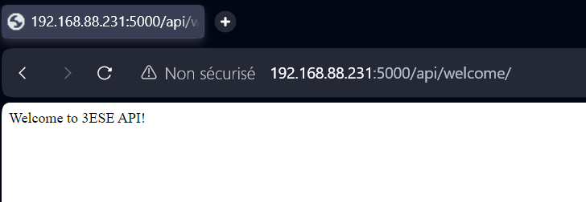
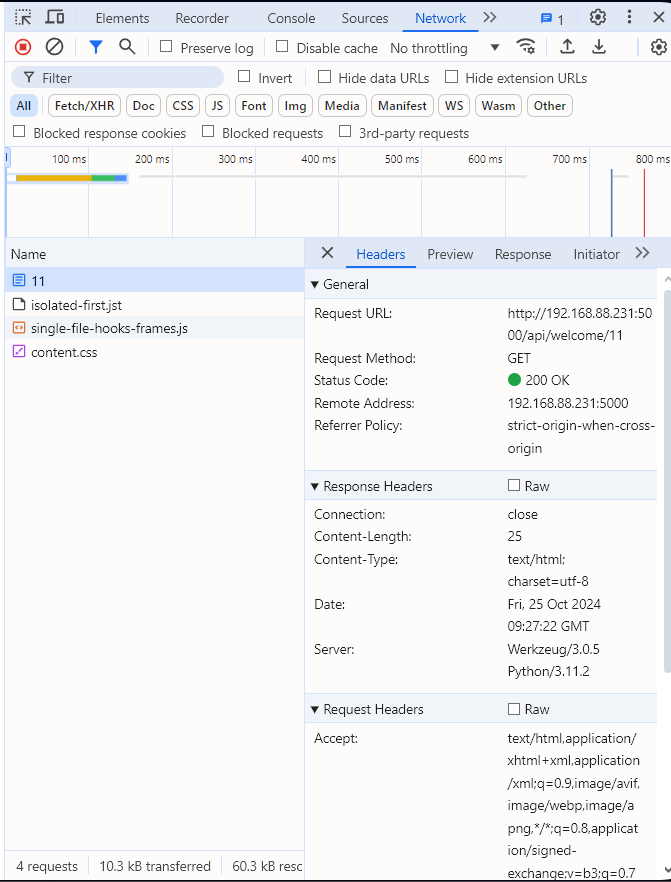
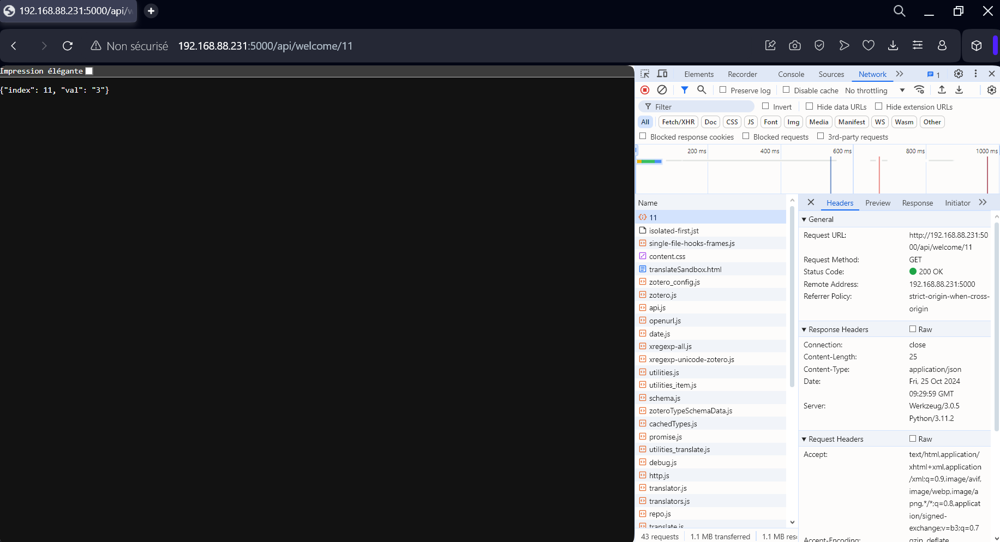
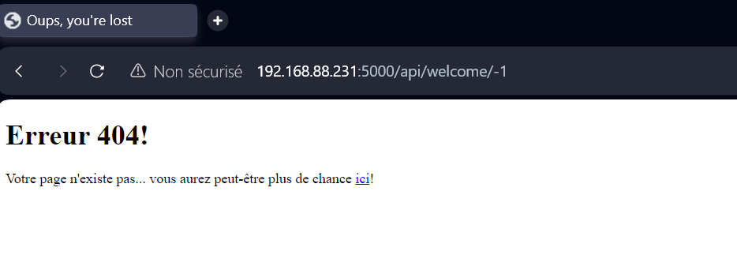
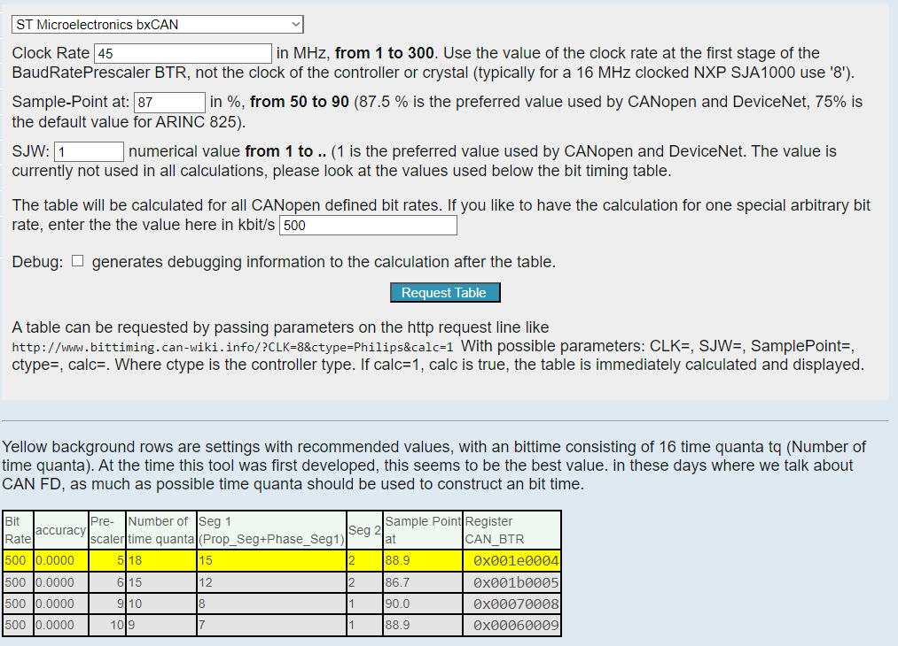

# TP_Bus_Reseaux #
### Authors : JP Thomar, P. Boulot
### Professor : C. Barès 
### Topics : Lab Sessions on communiaction between STM32F4, Raspberry Pi0 and sensors using I2C, CAN, UART, and WiFi communication 

##  Lab Session 1 : I2C Bus.  

Objective: Interfacing a STM32 with I2C sensors  

The first step is to set up the communication between the microcontroller and sensors (temperature, pressure, accelerometer...) via the I2C bus.
The sensor has two I2C components, which share the same bus. The STM32 will act as master on the bus.
The STM32 code will be written in C language, using the HAL library.

### 2.1 BMP280 Sensor

From the datasheet of the pressure sensor BMP280 we can determine the following pieces of information : 
- possible I2C adresses for this component : 0x76 and 0x77
- the register and the value to identify this component : register : 0xD0 "id", value : 0x58
- the register and value to set the component in normal mode : [0:1] bits in control register 0xF4 have to be set to 11
- the registers containing the component calibration : registers "calib25" to "calib00" with adresses 0xA1 to 0x88
- the temperature records (and format) : "temp" registers contains the raw temperature measurement data output up[19:0] at the adresses 0xFA, 0xFB, and 0xFC 
- the pressure registers (and format) : "press" registers contains the raw pressure measurement data output up[19:0] at the adresses 0xF7, 0xF8, and 0xF9
- the functions for calculating the temperature and pressure compensated, in 32-bit integer format : cf datasheet p.23

### 2.2 STM32 Setup

For this lab sessions, we will use the STM32446RETX board on STM32CubeIDE with the following connections : 
- PB8 : I2C1_SDA
- PB9 : I2C1_SCL
- PA2 : USART2_TX (USB)
- PA3 : USART2_RX
- PA0 : UART4_TX (communication with raspberry pi)
- PA1 : UART4_RX
- PA12 : CAN1_TX
- PA11 : CAN1_RX

We modified the printf fonction to make it returns its strings on the UART to USB link, by adding the following code to the stm32f4xx_hal_msp.c file :  

```C
/* USER CODE BEGIN PV */
extern UART_HandleTypeDef huart2;
/* USER CODE END PV */
/* USER CODE BEGIN Macro */
#ifdef __GNUC__ /* With GCC/RAISONANCE, small printf (option LD Linker->Libraries->Small printf    set to 'Yes') calls __io_putchar() */
#define PUTCHAR_PROTOTYPE int __io_putchar(int ch)
#else
#define PUTCHAR_PROTOTYPE int fputc(int ch, FILE *f)
#endif /* __GNUC__ */
/* USER CODE END Macro */
/* USER CODE BEGIN 1 */
/**
  * @brief  Retargets the C library printf function to the USART.
  * @param  None
  * @retval None
  */
PUTCHAR_PROTOTYPE
{
  /* Place your implementation of fputc here */
  /* e.g. write a character to the USART2 and Loop until the end of transmission */
  HAL_UART_Transmit(&huart2, (uint8_t *)&ch, 1, 0xFFFF);

  return ch;
}
/* USER CODE END 1 */
```

Echo type test of the UART compilation chain and communication over USB :  
in main loop : 
```C

uint8_t data; 
while (1)
	{
		//blocking code
		HAL_UART_Receive( &huart2, &data, 1, HAL_MAX_DELAY );
		printf("%s\r\n",&data);
	}
```
### 2.3 I2C communication 
#### BMP280 Identification 
Reading a register's data using I2C is as follows :  
1 - send the address of the registry ID  
2 - receive 1 byte corresponding to the contents of the register  
```C
* Private define ------------------------------------------------------------*/
#define BMP_ADDR 0x77<<1 // BMP280 address
#define BMP_ID_REG 0xD0 // adress of the ID register
```
```C
uint8_t id_buf[1];

void query_ID_BMP(){
	//query ID of the sensor BMP280
	id_buf[0]= BMP_ID_REG;
	HAL_I2C_Master_Transmit(&hi2c1,BMP_ADDR,id_buf,1,HAL_MAX_DELAY);
	HAL_I2C_Master_Receive(&hi2c1,BMP_ADDR,id_buf,1,HAL_MAX_DELAY);
	printf("BMP280 ID : %x\r\n",id_buf[0]);
}
```

#### Communication with BMP280
In I2C, the writing in a register is made as follows:  
1 - Send the address of the register to be written, followed by the value of the register  
2 - If received immediately, value received will be the new register value  

We will use the following configuration: normal mode, oversampling pressure x16, temperature oversampling x2. We will thus modify the 0xF4 "ctrl_meas" register with the following value :  
01010111 (010 oversampling t x2, 101 oversampling p x16,  11 mode normal)

```C
* Private define ------------------------------------------------------------*/
#define BMP_ADDR_MODE 0xF4 // address of the "ctrl_meas" reg to set the modes/config
#define BMP_MODE 01010111 //  010 oversampling t x2, 101 oversampling p x16,  11 mode normal
```
```C
uint8_t data_config[2];

void query_Config_BMP(){
	//Configuration and verification of the sensor
	data_config[0]= BMP_ADDR_MODE;
	data_config[1]= BMP_MODE;
	HAL_I2C_Master_Transmit(&hi2c1,BMP_ADDR,data_config,2,HAL_MAX_DELAY); //Send configuration to sensor
	HAL_I2C_Master_Receive(&hi2c1,BMP_ADDR,data_config,2,HAL_MAX_DELAY); //Recieve set configuration of sensor
	printf("Register : %x\r\n",data_config[0]);
	printf("Mode : %x\r\n",data_config[1]);
}
```
#### Calibration, temperature and pressure recovery

We will now retrieve the contents of the registers containing the BMP280 calibration in one go.
They are the followings ones : "calib25" to "calib00" with adresses 0xA1 to 0x88
```C
typedef struct { // structure containing calibration registers names (datasheet p.21)
    uint16_t dig_T1;  //0x88/0x89
    int16_t dig_T2;   //0x8A/0x8B
    int16_t dig_T3;
    uint16_t dig_P1;
    int16_t dig_P2;
    int16_t dig_P3;
    int16_t dig_P4;
    int16_t dig_P5;
    int16_t dig_P6;
    int16_t dig_P7;
    int16_t dig_P8;  //0x9C/0x9D
    int16_t dig_P9;  //0x9E/0x9F
} Struct_CalibDataNames;
```
```C
void query_Calib_BMP(){
	// Retrieving of calibration Data
	calib_reg[0] = BMP_CALIB_REG;
	HAL_I2C_Master_Transmit(&hi2c1, BMP_ADDR, calib_reg, 1, HAL_MAX_DELAY); //Query calibration of sensor
	HAL_I2C_Master_Receive(&hi2c1, BMP_ADDR, calib_data, BMP_CALIB_DATA_LENGTH, HAL_MAX_DELAY); //Receive calibration of the sensor
	calib_names->dig_T1 = (uint16_t)((calib_data[1] << 8) | calib_data[0]);
	calib_names->dig_T2 = (int16_t)((calib_data[3] << 8) | calib_data[2]);
	calib_names->dig_T3 = (int16_t)((calib_data[5] << 8) | calib_data[4]);
	calib_names->dig_P1 = (uint16_t)((calib_data[7] << 8) | calib_data[6]);
	calib_names->dig_P2 = (int16_t)((calib_data[9] << 8) | calib_data[8]);
	calib_names->dig_P3 = (int16_t)((calib_data[11] << 8) | calib_data[10]);
	calib_names->dig_P4 = (int16_t)((calib_data[13] << 8) | calib_data[12]);
	calib_names->dig_P5 = (int16_t)((calib_data[15] << 8) | calib_data[14]);
	calib_names->dig_P6 = (int16_t)((calib_data[17] << 8) | calib_data[16]);
	calib_names->dig_P7 = (int16_t)((calib_data[19] << 8) | calib_data[18]);
	calib_names->dig_P8 = (int16_t)((calib_data[21] << 8) | calib_data[20]);
	calib_names->dig_P9 = (int16_t)((calib_data[23] << 8) | calib_data[22]);
}
```

In the infinite loop of the STM32, we retrieve the raw values of temperature and pressure, then we send to the serial port the 32 bit uncompensated values of the temperature pressure.
```C
#define BMP_TEMP_PRESS_REG 0xF7 // 1st press register address
#define BMP_TEMP_PRESS_DATA_LENGTH 6 // size of press + temp registers
```
```C
void read_raw_t_p(int32_t *raw_press, int32_t *raw_temp){
	uint8_t raw_data[BMP_TEMP_PRESS_DATA_LENGTH];
	uint8_t reg = BMP_TEMP_PRESS_REG;

	if (HAL_I2C_Master_Transmit(&hi2c1, BMP_ADDR, &reg, 1, HAL_MAX_DELAY)==HAL_OK){
		HAL_I2C_Master_Receive(&hi2c1, BMP_ADDR, raw_data, BMP_TEMP_PRESS_DATA_LENGTH, HAL_MAX_DELAY);
		*raw_press = (int32_t)(((raw_data[0] << 16) | (raw_data[1] << 8) | raw_data[2]) >> 4);
		*raw_temp = (int32_t)(((raw_data[3] << 16) | (raw_data[4] << 8) | raw_data[5]) >> 4);
		printf("Raw Temp = %d,\r\nRaw Press = %d\r\n", raw_temp, raw_press);
	}
	else{
		printf("Erreur de communication sur le bus bus I2C\r\n");
	}
}
```

#### Calculation of compensated temperature and pressure 

The STM32 datasheet shows the code to compensate the temperature and pressure using the values of the calibration in the 32-bit integer format (we will not use floats for performance problems).  
The temperature and pressure offset values are transmitted to the serial port in a readable format.  

We have to redefine the type of the variable in the given code to fit the requirements of the datasheet :   

```C
typedef int32_t BMP280_S32_t;
typedef uint32_t BMP280_U32_t;
typedef int64_t BMP280_S64_t;
```
Here is the code to return the compensated temperature and pressure :   
```C
/ Returns temperature in DegC, resolution is 0.01 DegC. Output value of “5123�? equals 51.23 DegC.
// t_fine carries fine temperature as global value

BMP280_S32_t bmp280_compensate_T_int32(BMP280_S32_t adc_T,BMP280_CalibDataNames *calib_names)
{
	BMP280_S32_t var1, var2, T;
	var1 = ((((adc_T>>3)-((BMP280_S32_t)calib_names->dig_T1<<1))) * ((BMP280_S32_t)calib_names->dig_T2)) >> 11;
	var2 = (((((adc_T>>4)-((BMP280_S32_t)calib_names->dig_T1)) * ((adc_T>>4)-((BMP280_S32_t)calib_names->dig_T1))) >> 12) * ((BMP280_S32_t)calib_names->dig_T3)) >> 14;
	t_fine = var1 + var2;
	T = (t_fine * 5 + 128) >> 8;
	return T;
}

// Returns pressure in Pa as unsigned 32 bit integer. Output value of “96386�? equals 96386 Pa = 963.86 hPa
BMP280_U32_t bmp280_compensate_P_int64(BMP280_S32_t adc_P, BMP280_CalibDataNames *calib_names)
{
	BMP280_S64_t var1, var2, p;
	var1 = ((BMP280_S64_t)t_fine)-128000;
	var2 = var1 * var1 * (BMP280_S64_t)calib_names->dig_P6;
	var2 = var2 + ((var1*(BMP280_S64_t)calib_names->dig_P5)<<17);
	var2 = var2 + (((BMP280_S64_t)calib_names->dig_P4)<<35);
	var1 = ((var1 * var1 * (BMP280_S64_t)calib_names->dig_P3)>>8) + ((var1 * (BMP280_S64_t)calib_names->dig_P2)<<12);
	var1 = (((((BMP280_S64_t)1)<<47)+var1))*((BMP280_S64_t)calib_names->dig_P1)>>33;
	if (var1 == 0)
	{
		return 0; // avoid exception caused by division by zero
	}
	p = 1048576-adc_P;
	p = (((p<<31)-var2)*3125)/var1;
	var1 = (((BMP280_S64_t)calib_names->dig_P9) * (p>>13) * (p>>13)) >> 25;
	var2 = (((BMP280_S64_t)calib_names->dig_P8) * p) >> 19;
	p = ((p + var1 + var2) >> 8) + (((BMP280_S64_t)calib_names->dig_P7)<<4);
	return (BMP280_U32_t)p;
}
```

Finally, we use all the previous code in the main loop to get the temprature and pressure and display them using a serial terminal (TeraTerm) :

```C
int main(void){
	HAL_Init();
	SystemClock_Config();
	MX_GPIO_Init();
	MX_USART2_UART_Init();
	MX_CAN1_Init();
	MX_UART4_Init();
	MX_TIM2_Init();
	MX_I2C1_Init();

	printf("==== TP BUS & NETWORK ====\r\n");
	querry_ID_BMP();
	querry_Config_BMP();
	querry_Calib_BMP();

	while (1)
	{
	//Retrieving the raw temp and press values
	read_raw_t_p(&raw_temp, &raw_press);

	// Compensated temperature and pressure
	int32_t temp = bmp280_compensate_T_int32(raw_temp, calib_names);
	int32_t press = bmp280_compensate_P_int64(raw_press, calib_names);
	printf("Compensated Temp = %ld C\r\nCompensated Press = %ld Pa\r\n", temp/100, press/256);
	}
}
```

## Lab Session 2 : STM32 - Raspberry Pi 0 WIFI interfacing using serial communication
During this session we are going to establish the communication between the two boards Raspberry Pi 0 WIFI ("RPi" below) and STM32.

### 3.1 Setting and start up of the Raspberry Pi 0 Wifi
First, we follow a few steps to prepare the RPi: 

- Download the image "Raspberry Pi OS (32-bit) Lite" on the SD card. 
- Use the Rpi_imager software to install it on the SD card.  
Host name : raspberrypiJPP  
Id : TPBUSJPP , Password : TPBUSJPP  
Wifi configuration : SSID = ESE_Bus_Network / PW = **********  
Local settings : Time zone : Europe/Paris, Keyboard type : fr  

- A free IP adress in the network is assigned to the RPi : 192.168.88.231
- Connect the Pi0 to the PC via SSH using the following command : "ssh TPBUSJPP@192.168.88.231".
- Enter the password : TPBUSJPP

### 3.2 Serial port  
Loopback  
We pluged the serial port of the RPi in such way that Rx and TX are loopped, and used Minicom to test it and verify the access to the loopback. 

Communication with the STM32  
To communicate with the STM32, an independant UART port is used (UART 4, cf Lab session 1).  
We modify the printf fonction to enable it to display on both serial port (UART 2 and UART 4).  

```C
//redefinition of printf
PUTCHAR_PROTOTYPE
{
  /* Place your implementation of fputc here */
  /* e.g. write a character to the USART2 and Loop until the end of transmission */
  HAL_UART_Transmit(&huart2, (uint8_t *)&ch, 1, 0xFFFF);
  HAL_UART_Transmit(&huart4, (uint8_t *)&ch, 1, 0xFFFF);

  return ch;
}

```

### 3.3. Command from Python

We create a script in Python3 that allows to communicate with STM32.  

## Lab Session 3 : REST interface
Id : jpp , Login : TPBUSJPP  
Wifi configuration : SSID = ESE_Bus_Network / PW = **********  
Local settings : Time zone : Europe/Paris, Keyboard type : fr  

- A free IP adress in the network is assigned to the RPi : 192.168.88.231
- Connect the Pi0 to the PC via SSH using the following command : "ssh jpp@192.168.88.231".

```py
from flask import Flask
app = Flask(__name__)

@app.route('/')
def hello_world():
    return 'Hello, World!\n'
```
<p align="center">  </p>

```py
from flask import Flask
app = Flask(__name__)

@app.route('/')
def hello_world():
    return 'Hello, World!\n'

welcome = "Welcome to 3ESE API!"

@app.route('/api/welcome/')
def api_welcome():
    return welcome

@app.route('/api/welcome/<int:index>')
def api_welcome_index(index):
    return welcome[index]
```

<p align="center">  </p>

@app.route role : add elements to the url to run corresponding function, here to print welcome sting

<int:index> role : add element to the url to run corresponding function, here print element at index position of welcome string

1st solution
```py
import Flask
from flask import jsonify

app = Flask(__name__)

@app.route('/')
def hello_world():
    return 'Hello, World!\n'

welcome = "Welcome to 3ESE API!"

@app.route('/api/welcome/')
def api_welcome():
    return welcome

@app.route('/api/welcome/<int:index>')
def api_welcome_index(index):
    return json.dumps({"index": index, "val": welcome[index]})
```
<p align="center">  </p>

<p align="center">  </p>

```py
import Flask
from flask import jsonify

app = Flask(__name__)

@app.route('/')
def hello_world():
    return 'Hello, World!\n'

welcome = "Welcome to 3ESE API!"

@app.route('/api/welcome/')
def api_welcome():
    return welcome

@app.route('/api/welcome/<int:index>')
def api_welcome_index(index):
    return jsonify({"index": index, "val": welcome[index]}), {"Content-Type": "application/json"}
```

<p align="center">  </p>

Error 404

```py
from flask import Flask
from flask import jsonify
from flask import render_template
from flask import abort
app = Flask(__name__)

@app.route('/')
def hello_world():
    return 'Hello, World!\n'

welcome = "Welcome to 3ESE API!"

@app.route('/api/welcome/')
def api_welcome():
    return welcome

@app.route('/api/welcome/<int:index>')
def api_welcome_index(index):
    if index<0 or index>len(welcome):
        abort(404)
    else:
        return jsonify({"index": index, "val": welcome[index]}), {"Content-Type": "application/json"}

@app.errorhandler(404)
def page_not_found(error):
    return render_template('page_not_found.html'), 404
```
<p align="center">  </p>


## Lab session 4 : CAN Bus

Objective: Implementation of a device (Stepper motor) on CAN bus

The STM32F446 boards have an integrated CAN controller. We need a CAN transceiver to use it, and we will choose the TJA1050. It works with a 5V supply and has 3.3V compatible I/O.  
We will use the CAN bus to drive a stepper motor module. This module is powered by +12V. All the information needed to use this module is available in the document nammed "motor" of this repository.  

We need to set the CAN Baud rate to 500kbit/s to use this motor. It seems that it is mainly the ratio seg2/(seg1+seg2), which determines the moment of decision, which must be around 87%. We can use the following calculator: http://www.bittiming.can-wiki.info/  

We find these values to obtain 500kbits/s:  
PSC = 5  
seg 1 : 15 times  
seg 2 : 2 times  

<p align="center">  </p>

### 5.1 Motor control

First, a simple code is set up that moves the motor 90° in one direction and then 90° in the other, with a period of 1 second.  

The following HAL primitives are used for this:
```C
HAL_StatusTypeDef HAL_CAN_Start (CAN_HandleTypeDef * hcan)
``` 
to activate the CAN module and  
```C
HAL_StatusTypeDef HAL_CAN_AddTxMessage (CAN_HandleTypeDef * hcan, CAN_TxHeaderTypeDef * pHeader, uint8_t aData[], uint32_t * pTxMailbox)
```
to send a message.  

In the main program : 
```C
// Variables CAN
CAN_TxHeaderTypeDef   TxHeader;
uint8_t               TxData[3];
uint32_t              TxMailbox;

// Motor pilot : +90 degree
TxHeader.IDE = CAN_ID_STD;
TxHeader.StdId = 0x61;
TxHeader.RTR = CAN_RTR_DATA;
TxHeader.DLC = 2;
TxHeader.TransmitGlobalTime = DISABLE;

TxData[0] = 90; 	//angle
TxData[1] = 0x00;	//positive
//TxData[2] = 0xA0;	//speed

HAL_CAN_Start(&hcan1);
```
Infinite loop : 
```C
if(HAL_CAN_AddTxMessage(&hcan1, &TxHeader, TxData, &TxMailbox)!= HAL_OK){
	printf("Erreur de communication sur le bus CAN\r\n");
	return 0;
}
else{
	printf("Commnication établie\r\n");
}
if(TxData[1]==1){
		TxData[1] = 0;
}
else{
	TxData[1]=1;
}
```
## Lab session 4 : Integration I²C - Serial - REST - CAN

FASTAPI code
```py
from fastapi import FastAPI, HTTPException
from pydantic import BaseModel
from typing import List
import serial
import asyncio

app = FastAPI()

# Global variable to manage the serial connection
ser = None

class SerialConnectionRequest(BaseModel):
    port: str = "COM11"  # e.g., "COM3" on Windows or "/dev/ttyUSB0" on Linux
    baudrate: int = 115200  # Default baudrate

class Command(BaseModel):
    action: str

@app.post("/connect")
async def connect_to_serial(request: SerialConnectionRequest):
    global ser
    if ser and ser.is_open:
        return {"status": "Already connected", "port": ser.port}
    
    try:
        ser = serial.Serial(port=request.port, baudrate=request.baudrate, timeout=1)
        return {"status": "Connected", "port": ser.port, "baudrate": ser.baudrate}
    except serial.SerialException as e:
        raise HTTPException(status_code=400, detail=f"Failed to connect: {str(e)}")

@app.post("/disconnect")
async def disconnect_serial():
    global ser
    if ser and ser.is_open:
        ser.close()
        return {"status": "Disconnected"}
    return {"status": "No active connection"}

@app.post("/stm32/send-command/")
async def send_command(command: Command):
    """Send command on serial port for STM32"""
    try:
        ser.write(command.action.encode('utf-8'))
        # Read response of STM32
        await asyncio.sleep(0.1)  # Delay to let STM32 respond
        response = ser.readline().decode('utf-8')
        cleaned_response = response.replace('\x00', '').strip()
        return {"status": "Command sent", "response": cleaned_response}

    except serial.SerialException as e:
        raise HTTPException(status_code=500, detail=f"Serial communication error: {e}")

# Variables to store data
temperatures = [10,11] //test values
pressures = []
scale = "K"  # Initialise scale in Kelvin

class Temperature(BaseModel):
    temp: float     

class Pressure(BaseModel):
    pres: float

class ScaleChange(BaseModel):
    scale: str

# POST /temp
@app.post("/temp/", status_code=201)
async def create_temperature(temp: Temperature):
    temperatures.append(temp.temp)
    return {"message": "Temperature added", "temperature": temp.temp}


# POST /press
@app.post("/pres/", status_code=201)
async def create_pressure(pres: Pressure):
    pressures.append(pres.pres)
    return {"message": "Pressure added", "pressure": pres.pres}


# GET /temp
@app.get("/temp/", response_model=List[float])
async def get_temperatures():
    return temperatures


# GET /temp/{x}
@app.get("/temp/{x}")
async def get_temperature(x: int):
    if 0 <= x < len(temperatures):
        return {"temperature": temperatures[x]}
    else:
        raise HTTPException(status_code=404, detail="Temperature not found")


# 5. GET /pres/
@app.get("/pres/", response_model=List[float])
async def get_pressures():
    return pressures


# 6. GET /pres/{x}
@app.get("/pres/{x}")
async def get_pressure(x: int):
    if 0 <= x < len(pressures):
        return {"pressure": pressures[x]}
    else:
        raise HTTPException(status_code=404, detail="Pressure not found")


# 7. GET /scale/
@app.get("/scale/")
async def get_scale():
    return {"scale": scale}


# 8. GET /angle/
@app.get("/angle/")
async def get_angle():
    if temperatures:
        # Exemple de calcul, vous pouvez ajuster selon la logique
        angle = temperatures[-1] * (273 if scale == "K" else 1)
        return {"angle": angle}
    else:
        raise HTTPException(status_code=400, detail="No temperature available")


# 9. POST /scale/{x}
@app.post("/scale/{x}")
async def change_scale(x: int, scale_change: ScaleChange):
    global scale
    if scale_change.scale not in ["K", "C", "F"]:
        raise HTTPException(status_code=400, detail="Invalid scale")
    scale = scale_change.scale
    return {"message": f"Scale changed to {scale}", "new_scale": scale}


# 10. DELETE /temp/{x}
@app.delete("/temp/{x}")
async def delete_temperature(x: int):
    if 0 <= x < len(temperatures):
        deleted_temp = temperatures.pop(x)
        return {"message": "Temperature deleted", "deleted_temperature": deleted_temp}
    else:
        raise HTTPException(status_code=404, detail="Temperature not found")


# 11. DELETE /pres/{x}
@app.delete("/pres/{x}")
async def delete_pressure(x: int):
    if 0 <= x < len(pressures):
        deleted_pres = pressures.pop(x)
        return {"message": "Pressure deleted", "deleted_pressure": deleted_pres}
    else:
        raise HTTPException(status_code=404, detail="Pressure not found")

#uvicorn hello:app --host 192.168.88.231  launch serv on rasp pi

#uvicorn TP:app --host 0.0.0.0 --port 80 lauch serv on PC for network
```
 
